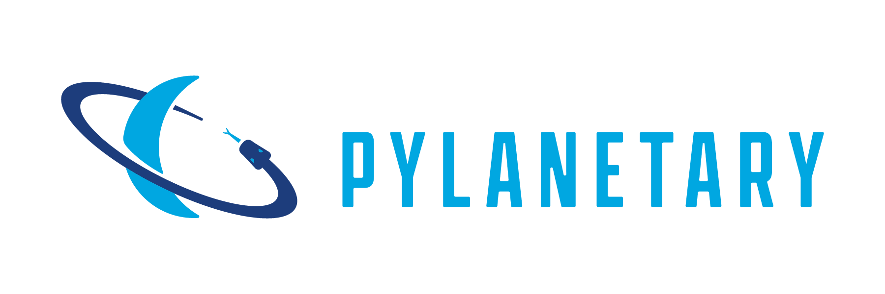

data processing and modeling tools for ring, moon, and planet observations
--------------------------------------------------------------------------

.. image:: https://readthedocs.org/projects/pylanetary/badge/?version=latest
    :target: https://pylanetary.readthedocs.io/en/latest/?badge=latest
    :alt: Documentation Status
   
.. image:: https://codecov.io/gh/emolter/pylanetary/branch/main/graph/badge.svg
   :target: https://codecov.io/gh/emolter/pylanetary
   :alt: Code Coverage Badge

.. image:: http://img.shields.io/badge/powered%20by-AstroPy-orange.svg?style=flat
    :target: http://www.astropy.org
    :alt: Powered by Astropy Badge
	
.. image:: https://zenodo.org/badge/459414964.svg
   :target: https://zenodo.org/badge/latestdoi/459414964
   :alt: Zenodo DOI Badge

Installation
------------

``pip install python`` (any Python 3.9 to 3.12)

Features
--------
* Navigation and re-projection for solar system imaging observations (makes use of Cartopy); `Tutorial <link>`_.
* Read/write navigated solar system images in the xx multi-extension fits format, originally developed for the HST OPAL program; `Tutorial <link>`_.
* Utilities for solar-system-specific unit conversions like I/F; `Tutorial <link>`_.
* Ring-moon system modeling and model-data comparison; `Tutorial <link>`_.
* (coming soon) Compute Doppler winds from image cubes and compare with simulation output (e.g. EPIC)

Usage
-----
See our `readthedocs page <https://pylanetary.readthedocs.io/en/latest/>`_

Scope and Goal
--------------
The idea behind pylanetary is to bring solar system science tools into 
the open-source Python 3 / Astropy ecosystem. We, and many of our colleagues, 
rely heavily on useful code snippets passed down from other solar system scientists. 
But these pieces of code are untested, in multiple languages, closed-source, 
and have many untracked dependencies. We want to fix that.
The eventual goal is to become Astropy-affiliated, but that is a long way off. 
We would love your help developing it!  See Contributing.

Disclaimer
----------
Pylanetary is developed and maintained by a small group of scientists. 
Most of us are not primarily software engineers, and we do not get paid to do this.
While we do our best, there is no guarantee that every function works as intended.
Use these tools with caution, and ensure that what you're getting out makes sense.
If you do discover a problem, please help us out by submitting an issue
on our issues page, or fix it yourself! See Contributing.

License
-------
This project is Copyright (c) Edward Molter & Chris Moeckel and licensed under
the terms of the GNU general public license. This package is based upon
the `Astropy package template <https://github.com/astropy/package-template>`_
which is licensed under the BSD 3-clause license. See the licenses folder for
more information.

Contributing
------------
We love contributions! Pylanetary is open source,
built on open source, and we'd love to have you hang out in our community.
Please read `the contribution page <https://pylanetary.readthedocs.io/en/latest/contributing.html>`_ before you start.

**Imposter syndrome disclaimer**: We want your help. No, really.

There may be a little voice inside your head that is telling you that you're not
ready to be an open source contributor; that your skills aren't nearly good
enough to contribute. What could you possibly offer a project like this one?

We assure you - the little voice in your head is wrong. If you can write code at
all, you can contribute code to open source. Contributing to open source
projects is a fantastic way to advance one's coding skills. Writing perfect code
isn't the measure of a good developer (that would disqualify all of us!); it's
trying to create something, making mistakes, and learning from those
mistakes. That's how we all improve, and we are happy to help others learn.

Being an open source contributor doesn't just mean writing code, either. You can
help out by writing documentation, tests, or even giving feedback about the
project (and yes - that includes giving feedback about the contribution
process). Some of these contributions may be the most valuable to the project as
a whole, because you're coming to the project with fresh eyes, so you can see
the errors and assumptions that seasoned contributors have glossed over.

Note: This disclaimer was originally written by
`Adrienne Lowe <https://github.com/adriennefriend>`_ for a
`PyCon talk <https://www.youtube.com/watch?v=6Uj746j9Heo>`_, and was adapted by
pylanetary based on its use in the README file for the
`MetPy project <https://github.com/Unidata/MetPy>`_.

Logo Credit
-----------
Our logo was designed by graphic designer Jacob Waliszewski. 
Check out his website at `https://www.jwdesignco.com/ <https://www.jwdesignco.com/>`_.